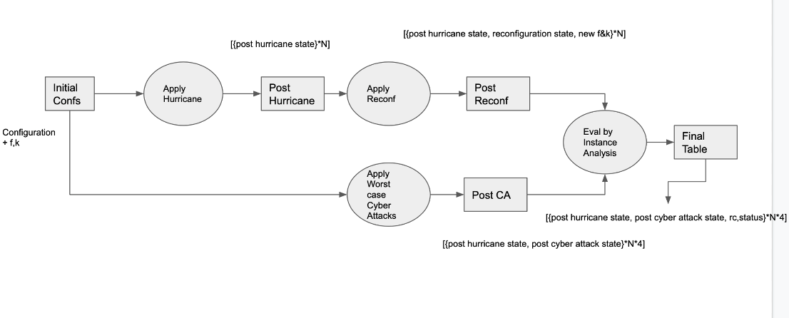
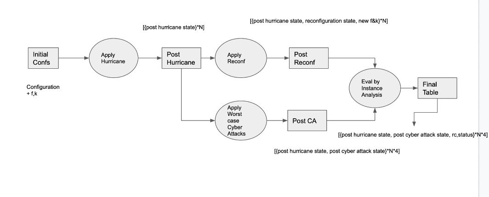
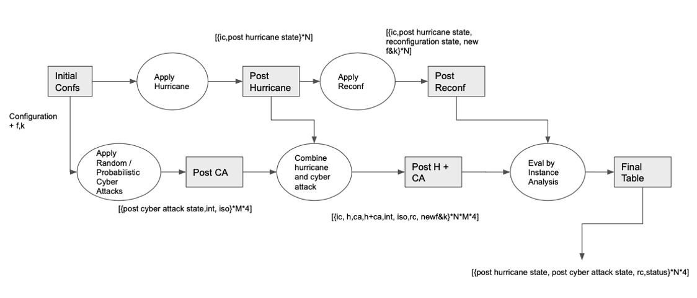

### Document Outline:

1.  **Threat Models Implemented:** We describe the three attack models we implemented in the analyzer. Specifically, they are: 
    - Worst case,
    - Uniformly Random, and
    - Probabilistic attack method

2.  **Reconfiguration:** In the current implementation of the analyzer, the reconfiguration can either take place after the hurricane has struck and before the cyberattack, or in the aftermath of both the hurricane and the cyberattack. There are also a few other valid points in time when one could reconfigure the system. That is not implemented yet. More on this in Section II.

3.  **Running Instructions with Options**

**Github Repository:** https://github.com/spire-resilient-systems/compound_threat_analyzer

**<u>Section I. Threat Models Implemented:</u>**

1.  **Worst case**

We assume the attacker has the following power options - no power, a power to choose and compromise a single node, a power to choose and isolate a single site, and a power to both choose and compromise a node, and choose and isolate a site.

For each hurricane instance, we start from a fully working system with the given initial configuration and then run that instance. Next, we simulate the remaining system under the cyberattack options listed above with the additional following setting:

- No hurricane knowledge - The cyberattacks do not have any knowledge of the hurricane and do not know what the remaining system state is.

- With Hurricane knowledge - The cyberattacks have knowledge of the hurricane and know what the remaining system state is.

2.  **Random**

The attacker has four buckets or options (no attack, site isolation, server intrusions and site attacks with simultaneous intrusions) of attacks. We set the limits on site isolations and server intrusions. The attacker randomly selects the required sites or servers according to threshold.

The attacker knows the initial configuration and we model ‘random_count’ of cyber attack instances per bucket. So given an initial configuration and thresholds, we will generate (4\*random_count) cyber attack instances for the initial configuration.

The attacker has no knowledge of the after hurricane system state.
Hence, the attacker can isolate or intrude in a site that is already impacted by a natural disaster.

3.  **Probabilistic**

The attacker has a fixed probability of success for isolation and server intrusion. As such the attacker will try to isolate all sites and intrude all servers. We will give the attacker all isolations and intrusions they gain. We generate “random_count” of attack instances for the initial configuration. The attacker has no knowledge of the after hurricane system state. Hence, the attacker can isolate or intrude in a site that is already impacted by natural disaster.

-  No Threshold

In this case all the chances won are counted, so the attacker can gain more than the system design / tolerance level.

- Threshold

    - Random: We choose the threshold sites and intrusions randomly from the chances attacker won in no threshold model.
    - Worst: We choose the threshold sites and intrusions from the chances attacker won in no threshold model such that it has worst impact on system. Preference order in descending order: Site with more replicas, control centers, data centers. 

The work flow for random and Probabilistic modeling is below:

### Section II. Reconfiguration:

As of the current implementation we only consider reconfiguration once. But, there are choices with when to reconfigure:

- **Reconfiguration Option 1 - Implemented**

Reconfiguration is done before hurricane (might be based on prediction, for example).

- **Reconfiguration Option 2 - Implemented**

Reconfiguration is immediately after hurricane but before Cyberattack (or we can assume no cyberattack).

- **Reconfiguration Option 3 - Implemented**

Reconfiguration is after both the hurricane and the cyberattack. In our model, intrusions are not detected and only isolations are.

- **Reconfiguration Option 4 - Not Implemented Yet**

Reconfigure after hurricane but another reconfiguration after the cyberattack

### Section III. In-band and Out-of-band Reconfiguration:
During the process of reconfiguration, if enough replicas are available to form a quorum then the system can reconfigure without interruption and the operational state remains green as per our model. However, if there are not enough replicas, then out-of-band reconfiguration is attempted where the operational state would be orange as there would be an interruption in the system.

### Section IV. Running Instructions with Options:

We have the following options to specify when running the analyzer:

    - input_file: 
        specifies the input file
    - configuration: 
        specifies intrusion tolerant system configuration
    - f: 
        number of intrusions tolerated
    - k: 
        number of downed replicas tolerated
    - random_count: 
        specifies random cyber attack instances to generate
    - server_threshold: 
        specifies server intrusion threshold for random and probabilistic methods
    - sites_threshold: 
        specifies site isolation threshold for random and probabilistic methods
    - method: 
        attacker power to use - 1 means Worst, 2 means Random, and 3 means Probabilistic method
    - num_hurricane_instances: 
        specify number of hurricane instances
    - reconfiguration: 
        1 means On, 0 means Off
    - hurricane_knowledge: 
        decide whether cyberattack has hurricane knowledge for method 1 (worst case). 'yes' and 'no' are the valid options. Goes with 'no' by default.
    - probability_choice: 
        specifies the choice type in probability method with thresolds, 1 is random, 2 is worst case
    - bucket: 
        specifies what the attacker can take down. 1 - No attack, 2 - Server Intrusion only, 3 - Site Isolation only,  4 - Both Site Isolation and Server Instrusions
    - site_prob: 
        probability to use for site isolation cyberattack in method 3 (probabilistic method)
    - server_prob: 
        probability to use for server intrusion cyberattack in method 3 (probabilistic method)
    - simple_print: 
        decide whether to print simple output or more information
    - output_write_to_file: 
        decide whether to write output to file. 'yes' and 'no' are the valid options.
    - output_file: 
        output filename with path from the root directory of the project.
    - num_CCs:
        specify the number of Control Centres. By default, the first 2 sites in the config are assumed to be Control Centres.
    -save_run_table:
        decide whether to save the large run table or not. Useful in debugging. Valid choices: 'yes' and 'no'. 'no' by default.
    - reconf_rules:
        the file that contains the rules for reconfiguration. By default "reconf_rules.txt" file is used.
    - seed: 
        the integer to use as seed for randomization. Default seed is 0.
    - hurricane_subset:
        If you want to run on a subset of hurricanes in the input file. Valid inputs: 'all', '[start,end]'. For range, first hurricane is hurricane no. 1 not 0. Limits are inclusive.'
    - events_sequence:
        The sequence of events specifically the reconfiguration scenarios. 0 is when reconfiguration happens preemptively based on Hurricane knowledge followed by a CA. 1 is when CA is in the aftermath of hurricane and reconfiguration happends on Hurricane impact knowledge only. 2 is when CA coincide with the hurricane and reconfiguration happens with the knowledge of both.
